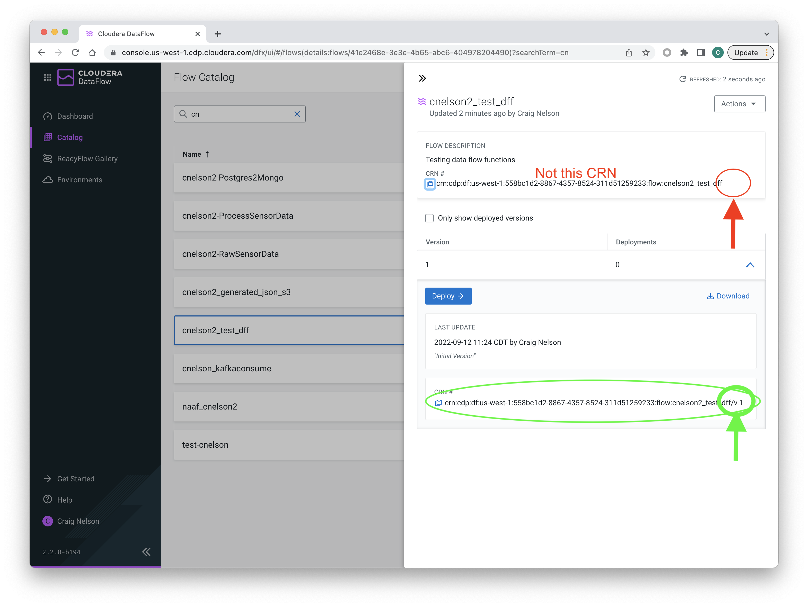

Basis doc is here:  https://docs.google.com/document/d/1Y5fxctYIXAOejvl-Kl9PVvuadP7VLmvwLtCNL3CEDFg/edit#


The purpose of this lab is to use a Data Flow Function in AWS (aka serverless Nifi) to "monitor" an s3 bucket for new objects, and then put the metadata for that object into another S3 bucket.   Nothing earth shattering here.   The point of this is to demonstrate data flow functions, it is up to the reader to find something novel to do with them.

Data Flow Functions is a way to run nifi flows without provisioning any resources to run your flow, instead using an AWS Lambda to execute your flow whenever it is triggered.   The lambda code is actually a nifi binary supplied by Cloudera/CDP, which is just the nifi engine.   Your lambda will know about your flow by virtue of a lambda environment variable that points to your specific flow in the CDF flow catalog.   Note that you *do not need a CDP environment to run nifi this way.*  The flow catalog actually lives in the CDP Control Plane.


## 1.  Create a Flow


Either in a docker container running locally or in a Data Flow data hub, build out a simple flow inside a processor group.

* Create a parameter context with the name:  `NAAF_CONTEXT`
  * add parameters for your AWS access & secret keys (Note:  `AWS_ACCESS_KEY` & `AWS_SECRET_KEY` appear to be reserved names within Lambda)
* add an input port from local connections
  * this will recieve the event trigger payload; bascially info from whatever has triggered our flow
* connect it to a log attributes processor
  * no config necessary
* connect it to a PutS3 processor
  * configure it to put files to an S3 bucket in your desired region (I used us-east-2)
  * set the access & secrets to the parameters you created: i.e. `#{cloud_access_key}` 
* add an output port named `failures` and connect the failure outputs of other processors to it; don't terminate your failures.

Download your flow definition.   This is what we will upload to the CDF Flow Catalog.


## 2.  Import Your Flow Definition to the CDF Flow Catalog

You don't need a cluster or even a CDP environment.   Just the catalog, which lives in the control plane.


## 2a.  Optional:  Create a Machine User in CDP

You don't have to do this, but it's probably a best practice, since you can restrict the roles to be minimal privs.  The alternative is to use your personal CDP secret & access key.   Either way your Lambda will need to gain access to CDP in order to read the data flow catalog to find your flow definition.   If you do create a machine user, be certain to save the CSV with the access & secret keys.   You will need them later.

The only role the machine user needs is `DFCatalogViewer`


## 3.  Create a Lambda

From the AWS console create a new lambda function.
* author from scratch
  * runtime is Java 8 on Amazon Linux 2
  * x86_64 is the arch
  * << CREATE FUNCTION >>


## 4.  Configure your Lambda

### Upload the Code

The code itself will be an artifact you can download from the CDF UI once Data Flow Functions goes GA.  Until then it is held under lock & key; ask Pierre Villard for the link.  Downlaod it to your local machine, and then upload it it through the lambda console.

### Edit Runtime Settings

The handler defaults to `example.Hello::handleRequest`, but we need to change it to `com.cloudera.naaf.aws.lambda.StatelessNiFiFunctionHandler::handleRequest`


### Configure Environment Variables

Data Flow Functions suppors a bunch of environment variables to fine tune the flow operation.  For our purposes we only *need* 4 variables:


* `DF_ACCESS_KEY`: this is the CDP access key for your machine user.
* `DF_PRIVATE_KEY`:  this is the CDP private key for your machine user.
* `FAILURE_PORTS`:  you created an output port in your flow and connected processor failures to it.  This is the name of that output port.
* `FLOW_CRN`:  This is the CRN of your flow in the Flow Catalog.  Make sure you use the CRN that includes your flow's version, ending in `/v.1` or whatever the actual version number is.



If your flow has other paramters defined (such as AWS credentials), you can add them here as well.  However if you have parameters you wish to keep more secure (such as AWS credentials), you may prefer to keep them in an AWS Secret.  Lambda will first look for flow paramters in the Lambda environment varialbes, but if it doesn't find them it will look for an AWS Secret with the same name as your flow's parameter context.


    
### OPTIONAL:  Create/Configure an AWS Secret

* Create a new secret
* Select "other type of secret"
* Supply key/value pairs for your sensitive paramters, being certain that the keys match exactly with the parameter names in your flow
* Save the secret with the exact same name as your flow's parameter context


### OPTIONAL:  Allow Usage of the Secret

If you used a secret, you need to allow your Lambda to access that secret.   From the Lambda Console, under Configuration, go to Permissions and find the IAM Role Lambda created for you.   Clicking on it will open a new browser tab for the IAM page for that role.   The role itself has basic lambda execution permisions, which is not permissive enough to access your secret.  


* Click Add Permisions
  * Click Create inline policy


* When the Create Policy page opens, click on the JSON tab and paste the following IAM policy JSON document, being sure to change the resource to point to the ARN of your Secret.

```
{
    "Version": "2012-10-17",
    "Statement": [
        {
            "Effect": "Allow",
            "Action": [
                "secretsmanager:GetResourcePolicy",
                "secretsmanager:GetSecretValue",
                "secretsmanager:DescribeSecret",
                "secretsmanager:ListSecretVersionIds"
            ],
            "Resource": [
                "ARN:TO:YOUR:SECRET"
            ]
        },
        {
            "Effect": "Allow",
            "Action": "secretsmanager:ListSecrets",
            "Resource": "*"
        }
    ]
}
```

This will add permissions for your Lambda to list (but not accsss) all your secrets, and also the ability to read this and only this secret.  Give it a name, Click Review Policy, and then Create Policy to attach it to the role.


## Publish your Lambda

From the Lambda console, 
* Actions --> Publish
  * this will make it live, but you still need to invoke it somehow


## Add a Trigger

We need some mechanism to trigger our lambda, and for this exmample we want to trigger execution of our flow whenever an object shows up in a particular area in an S3 bucket.   

* Click on the `+ Add Trigger` button in your Lambda function.
* Open the dropdown and select your event source from the list.   S3 is what we're looking for here, but note there are tons of options.
* Put your bocket name in the Bucket box
* Trigger for all object create events
* Use `trigger-files/` as the prefix.   Think of this like a subdirectory; we're going to trigger on objects in the trigger-files/ subdirectory.
* Check the Recursive Invocation acknowldegement.   This is to ensure your flow is not going to write to the same bucket/prefix you're triggering on, because that could cause a singularity.  It won't prevent you from doing this, it's just making you acknowldege that this is a thing, and you're promising you're not that dumb.   


# Test it!


## Monitoring a Serverless Flow
Monitoring can be done via Monitoring from the lambda console, or look in cloudwatch.


## Troubleshooting notes

- if you need to upload a new version of your flow to CDF, be sure to change the Flow CRN in your lambda environment variables
- if you change anything about the lambda (i.e. environment variables) you'll need to republish the lambda, and a new version will become active
- if you publish a new version of your lambda, you'll notice that it will lose the trigger association.   That's because the trigger will still be attached to the prior version of the lambda.   There is no way from within lambda to handle this.  You must go to the thing that the trigger is on (the s3 bucket in our case, and edit the properties of the trigger.  You can point it to the new version of the lambda from there.  Or delete it and attach a new trigger from your labmda.

- Your cdp access keys may have an extra `%` character at the end.  This is not part of the key, don't include it.
