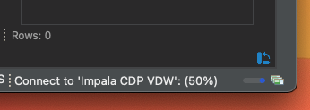

# Connecting to a Virtual Warehouse via Dbeaver


[](https://youtu.be/bKibGaCicW0)

 
## Environment setup

1.  Create a Virtual Warehouse (Hive or Impala, SSO enabled or otherwise...we'll connect to both)

    * [Walkthrough of creating a Virtual Warehouse](https://github.com/supahcraig/CLDR/blob/main/Labs/Data%20Warehouse/Virtual%20DW.md)

2.  Download the JDBC jar for Hive or the JDBC/ODBC driver for Impala


### Hive Jar
1.  Optionally copy the jar to wherever you like to keep your jars.  Wherever you decide to put it, you'll need this location later when we point Dbeaver to the downloaded jar.

2.  [Proceed to Dbeaver Connectivity](#Dbeaver-Connectivty)

---

### Impala Driver
1.  The impala jdbc/odbc driver comes down as a zip called `impala_driver_jdbc_odbc.zip`
2.  From Finder or the command line, unzip it and navigate to `ClouderaImpalaJDBC-<version>`, where the version # will likely change over time.

```
cnelson2@10434 impala-jar % unzip impala_driver_jdbc_odbc.zip
Archive:  impala_driver_jdbc_odbc.zip
   creating: ClouderaImpala_JDBC-2.6.23.1028/
   creating: ClouderaImpala_JDBC-2.6.23.1028/docs/
  inflating: ClouderaImpala_JDBC-2.6.23.1028/docs/Cloudera-JDBC-Driver-for-Impala-Install-Guide.pdf
  inflating: ClouderaImpala_JDBC-2.6.23.1028/docs/third-party-licenses.txt
  inflating: ClouderaImpala_JDBC-2.6.23.1028/docs/Cloudera-JDBC-Driver-for-Impala-Release-Notes.txt
  inflating: ClouderaImpala_JDBC-2.6.23.1028/docs/Cloudera-JDBC-Driver-for-Impala-Release-Notes.pdf
 extracting: ClouderaImpala_JDBC-2.6.23.1028/ClouderaImpalaJDBC42-2.6.23.1028.zip
 extracting: ClouderaImpala_JDBC-2.6.23.1028/ClouderaImpalaJDBC41-2.6.23.1028.zip
   creating: ClouderaImpalaODBC-2.6.13.1015/
  inflating: ClouderaImpalaODBC-2.6.13.1015/ClouderaImpalaODBC.dmg
  inflating: ClouderaImpalaODBC-2.6.13.1015/ClouderaImpalaODBC-32bit-2.6.13.1015-1.ppc.rpm
  inflating: ClouderaImpalaODBC-2.6.13.1015/Cloudera-ODBC-Driver-for-Impala-Install-Guide.pdf
  inflating: ClouderaImpalaODBC-2.6.13.1015/clouderaimpalaodbc-32bit_2.6.13.1015-2_i386.deb
  inflating: ClouderaImpalaODBC-2.6.13.1015/ClouderaImpalaODBC-2.6.13.1015-1.ppc.rpm
  inflating: ClouderaImpalaODBC-2.6.13.1015/Release-Notes-Impala-ODBC.pdf
  inflating: ClouderaImpalaODBC-2.6.13.1015/ClouderaImpalaODBC-2.6.13.1015-1.x86_64.rpm
  inflating: ClouderaImpalaODBC-2.6.13.1015/clouderaimpalaodbc_2.6.13.1015-2_amd64.deb
  inflating: ClouderaImpalaODBC-2.6.13.1015/ClouderaImpalaODBC-32bit-2.6.13.1015-1.i686.rpm
  inflating: ClouderaImpalaODBC-2.6.13.1015/ClouderaImpalaODBC64.msi
  inflating: ClouderaImpalaODBC-2.6.13.1015/ClouderaImpalaODBC32.msi

cnelson2@10434 impala-jar % cd ClouderaImpala_JDBC-2.6.23.1028

cnelson2@10434 ClouderaImpala_JDBC-2.6.23.1028 % ls -lart
total 38512
-rwxr-xr-x@ 1 cnelson2  staff  9808876 Feb 16  2021 ClouderaImpalaJDBC41-2.6.23.1028.zip
-rwxr-xr-x@ 1 cnelson2  staff  9906674 Feb 16  2021 ClouderaImpalaJDBC42-2.6.23.1028.zip
drwxr-xr-x@ 6 cnelson2  staff      192 Apr  2  2021 docs
drwxr-xr-x@ 5 cnelson2  staff      160 Apr  2  2021 .
drwxr-xr-x  5 cnelson2  staff      160 May  3 10:58 ..
cnelson2@10434 ClouderaImpala_JDBC-2.6.23.1028 %
```


3.  Under the `ClouderaImpala_JDBC-<version>` folder, Find `ClouderaImpalaJDBC41-<version>.zip` and copy it to wherever you keep your jars.  The actual Impala jar is inside that zip, but you don't need to unzip this for Dbeaver to use it.
4.  [Proceed to Dbeaver Connectivity](#Dbeaver-Connectivty)


---

## Dbeaver Connectivity

[Jump to Hive Connection](#Hive-Connection-Setup)

[Jump to Impala Connection](#Impala-Connection-Setup)


### Hive Connection Setup 

1.  Create a new connection in Dbeaver by right-clicking in the Database Navigator window, and navigating to Create --> Connection


2.  Select Apache Hive from the ist of database drivers.   


3.  Copy the JDBC URL from the CDP VDW screen, under the "3-dot" context menu for your virtual warehouse.   It will look something like this, depending on whether or not you enabled SSO when you created the Virtual Warehouse.

    * **Non-SSO:** 
        * `jdbc:hive2://hs2-<vdw name>.<env name>.a465-9q4k.cloudera.site/default;transportMode=http;httpPath=cliservice;socketTimeout=60;ssl=true;retries=3;`

    * **SSO:** 
        * `jdbc:hive2://hs2-<vdw name>.<env name>.a465-9q4k.cloudera.site/default;transportMode=http;httpPath=cliservice;socketTimeout=60;ssl=true;auth=browser;`


4. General Hive Connectivity

    * Take the copied URL and past into the host box.
        * remove the `jdbc:hive2://` prefix from the URL; dbeaver will add it for you in the JDBC URL box.
    * Leave the port empty.  
    * Database/Schema can be left empty or set to the database you want to connect into.
    * _The authentication section & Driver Settings will be covered later in this document._


5.  [Proceed to Authentication](#Authentication)

---

### Impala Connection Setup

1.  Create a new connection in Dbeaver by right-clicking in the Database Navigator window, and navigating to Create --> Connection


2.  Select Cloudera Impala from the ist of database drivers.   


3.  Copy the JDBC URL from the CDP VDW screen, under the "3-dot" context menu for your virtual warehouse.   It will look something like this, depending on whether or not you enabled SSO when you created the Virtual Warehouse.

    * **Non-SSO:** 
        * `jdbc:impala://coordinator-<vdw name>.<env name>.a465-9q4k.cloudera.site:443/default;AuthMech=3;transportMode=http;httpPath=cliservice;ssl=1;UID=cnelson2;PWD=PASSWORD`

    * **SSO:** 
        * `jdbc:impala://coordinator-hs2-<vdw name>.<env name>.a465-9q4k.cloudera.site:443/default;AuthMech=12;transportMode=http;httpPath=cliservice;ssl=1;auth=browser`


4. General Impala Connectivity

    * Take the copied URL and past into the host box.
        * remove the `jdbc:impala://` prefix from the URL; dbeaver will add it for you in the JDBC URL box.
    * Set the port to 443.  
    * Database/Schema can be left empty or set to the database you want to connect into.
    * _The authentication section & Driver Settings will be covered later in this document._


---

### Authentication

**for Non-SSO enabled Virtual Data Warehouse**

6.  Username/password are your CDP workload credentials. Check `Save Password Locally`

**for Non-SSO enabled Virtual Data Warehouse**

7.  Username/password are your SSO credentials.  Check `Save Password Locally`

---

### Driver Setup

The drivers that install with Dbeaver _may_ not work perfectly with your Virtual Warehouse.  It is recommended to use the drivers you can download directly from your Virtual Warehouse.  (See [Downloading Hive Jar](#Hive-Jar) and/or [Downloading Impala Jar](#Impala-Driver))

8.  Edit Driver Settings


10.  Go to the Libraries tab in the Edit Driver window.
  
11.  Dbeaver may have existing drivers for Hive/Impala.  You'll need to delete those in order for it to use your Cloudera-supplied driver.  Delete each of the existing files (click on each one, hit Delete).


12.  Click Add File to point dbeaver to your Cloudera-supplied driver.  Navigate to the location where you put the jar and select your file.

* **Hive:**
    *  `hive-jdbc-3.10-SNAPSHOT-standalone.jar`
    *  Click Find Class, it should return `org.apache.hive.jdbc.HiveDriver` in the dropdown.
*  **Impala:**
    * `ClouderaImpalaJDBC41-<version>.zip`
    *  Click Find Class, it should return `com.cloudera.jdbc41.Driver` in the dropdown.

Add File             |  Verify Driver Location
:-------------------------:|:-------------------------:
  |  


13.  Click Test Connection to verify successful configuration & connectivity.  If you didn't supply your credentials, it will prompt you for them now.   _If_ your Virtual Warehouse has SSO enabled, a browser tab will open to handle the authentication, which you can close if you like.   If you _aren't_ already signed into your SSO provider, the browser tab will be your SSO sign-in page.  You will need to authenticate before Dbeaver will connect.  If you _don't_ have SSO enabled, none of that applies.

Hive Test Connection             |  Impala Test Connection
:-------------------------:|:-------------------------:
  |  


---

# Running Queries

Open a new SQL window and execute a query.  If you see the barber pole for execution, you're in good shape.  You may have to wait for the VDW to spin back up, but it should run to completion.   SSO connections may ask for your SSO (Okta) username & password, which will briefly open a tab in your web browser to handle the SSO authentication.  If connection issues arise, invalidate/reconnect or a full disconnect/reconnect seems to do the trick.


---

# Troubleshooting

## SSO 

If your virtual warehouse is SSO Enabled, anything executed will need to first be authenticated via SSO.  If you aren't already SSO-authenticated, expect a browser tab to open up with your SSO login page whenever you connect, or if you try to run a query after your SSO has expired.  Re-authenticate via SSO, and then execute your SQL.


## AWS security groups?

Timeout issues are usually the result of a Cloud-provider firewall issue.  In AWS, this means the security group which manages the Hive/Impala connectivity is not open to your IP address on the necessary ports.   

TODO:  identify the necessary security groups & required ports


## Invalid Session ID

If you've already demonstrated that you are able to connect & run queries, but then mysteriously start seeing connection errors, it can usually be solved by using Dbeaver's Invaliate/Reconnect option, or by Disconnecting and the Reconnecting.


You can monitor the status of an establishing connection in the lower right corner of Dbeaver, although it will not show anything once the connection process has completed or failed.



You can also check the status of a connection in the Database Navigator.   Connected databases will show a green check.  Valid disconnected databases will not have any icon overlaid.   Invalid databases will have a red X.


