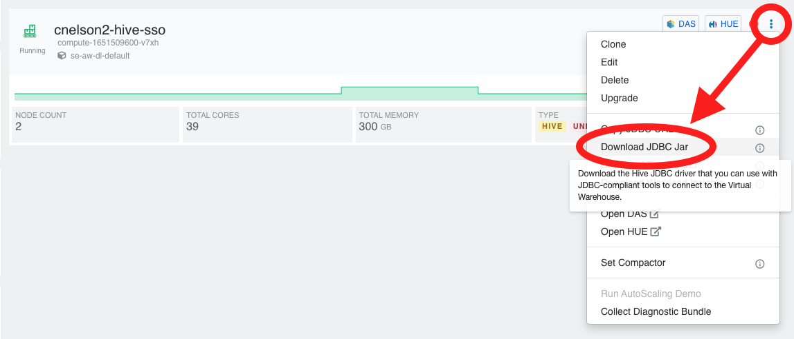

# Connecting to a Virtual Warehouse via External Tools

## Environment setup

1.  Create a Virtual Warehouse (hive or impala, SSO enabled or otherwise...we'll connect to both, although beeline doesn't work with SSO yet)
2.  Download the JDBC jar for Hive or the JDBC/ODBC jar for Impala

### Hive Jar
1.  Optionally copy the jar to wherever you like to keep your jars.  Wherever you put it, you'll need this location later when we point dbeaver to the downloaded jar.

2.  [Proceed to Dbeaver Connectivity](#Dbeaver-Connectivty)

---

### Impala Jar
1.  The impala jdbc/odbc comes down as a zip Unzip it, and navigate to `ClouderaImpalaJDBC-<version>`
2.  Find `ClouderaImpala_JDBC-<version>.zip` and copy it to wherever you keep your jars.
3.  [Proceed to Dbeaver Connectivity](#Dbeaver-Connectivty)

---

## Dbeaver Connectivity

[Jump to Hive Connection](#Hive-Connection-Setup)

[Jump to Impala Connection](#Impala-Connection-Setup)

### Hive Connection Setup 

1.  Create a new connection in Dbeaver by right-clicking in the Database Navigator window, and navigating to Create --> Connection

2.  Select Apache Hive from the ist of database drivers.   

3.  Copy the JDBC URL from the CDP VDW screen, under the "3-dot" context menu for your virtual warehouse.   It will look something like this, depending on whether or not you enabled SSO when you created the Virtual Warehouse.

    * **Non-SSO:** 
        * `hs2-cnelson2-hive.dw-se-sandbox-aws.a465-9q4k.cloudera.site/default;transportMode=http;httpPath=cliservice;socketTimeout=60;ssl=true;retries=3;`

    * **SSO:** 
        * `jdbc:hive2://hs2-cnelson2-hive-sso.dw-se-sandbox-aws.a465-9q4k.cloudera.site/default;transportMode=http;httpPath=cliservice;socketTimeout=60;ssl=true;auth=browser;`

4. General Hive Connectivity

    * Take the copied URL and past into the host box.
        * remove the `jdbc:hive2://` prefix from the URL; dbeaver will add it for you in the JDBC URL box.
    * Leave the port empty.  
    * Database/Schema can be left empty or set to the database you want to connect into.
    * _The authentication section & Driver Settings will be covered later in this document._

5.  [Proceed to Authentication](#Authentication)

---

### Impala Connection Setup

1.  create a new connection in Dbeaver
2.  Select Cloudera Impala
3.  Copy the JDBC URL from the CDP VDW screen, paste into the host box.  Remove the `jdbc:impala://` from the URL; dbeaver will add it for you.
4.  Port is 443
5.  database/schema can be `default` or a database of your choosing.

---

### Authentication

**for Non-SSO enabled Virtual Data Warehouse**

6.  Username/password are your CDP workload credentials. Check `Save Password Locally`

**for Non-SSO enabled Virtual Data Warehouse**

7.  Username/password are your SSO credentials.  Check `Save Password Locally`

---

### Driver Setup

The drivers that install with Dbeaver _may_ not work perfectly with your Virtual Warehouse.  It is recommended to use the drivers you can download directly from your Virtual Warehouse.  (See [Downloading Hive Jar](#Hive-Jar) and/or [Downloading Impala Jar](#Impala-Jar))

8.  Edit Driver Settings

10.  Go to the Libraries tab in the Edit Driver window.
  
11.  Dbeaver may have existing drivers for Hive/Impala.  You'll need to delete those in order for it to use your Cloudera-supplied driver.  Delete each of the existing files (click on each one, hit Delete).

12.  Click Add File to point dbeaver to your Cloudera-supplied driver.  Navigate to the location where you put the jar and select your file.

* **Hive:**
    *  `hive-jdbc-3.10-SNAPSHOT-standalone.jar`
    *  Click Find Class, it should return `org.apache.hive.jdbc.HiveDriver` in the dropdown.
*  **Impala:**
    * `ClouderaImpalaJDBC41-<version>.zip`
    *  Click Find Class, it should return `com.cloudera.jdbc41.Driver` in the dropdown.

Add File             |  Verify Driver Location
:-------------------------:|:-------------------------:
  |  

13.  Click Test Connection to verify successful configuration & connectivity.  If you didn't supply your credentials, it will prompt you for them now.   _If_ your Virtual Warehouse has SSO enabled, a browser tab will open to handle the authentication, which you can close if you like.   If you _aren't_ already signed into your SSO provider, the browser tab will be your SSO sign-in page.  You will need to authenticate before Dbeaver will connect.  If you _don't_ have SSO enabled, none of that applies.

Hive Test Connection             |  Impala Test Connection
:-------------------------:|:-------------------------:
  |  

---

### Running Queries

Open a new SQL window and execute a query.  If you see the barber pole for execution, you're in good shape.  You may have to wait for the VDW to spin back up, but it should run to completion.   SSO connections may ask for your SSO (Okta) username & password, which will briefly open a tab in your web browser to handle the SSO authentication.  If connection issues arise, invalidate/reconnect or a full disconnect/reconnect seems to do the trick.

---

## Troubleshooting

* SSO sign-in?
* AWS security groups?
* Invalid Session ID?
