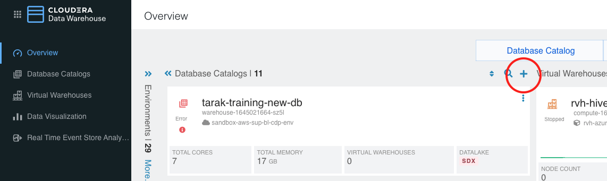
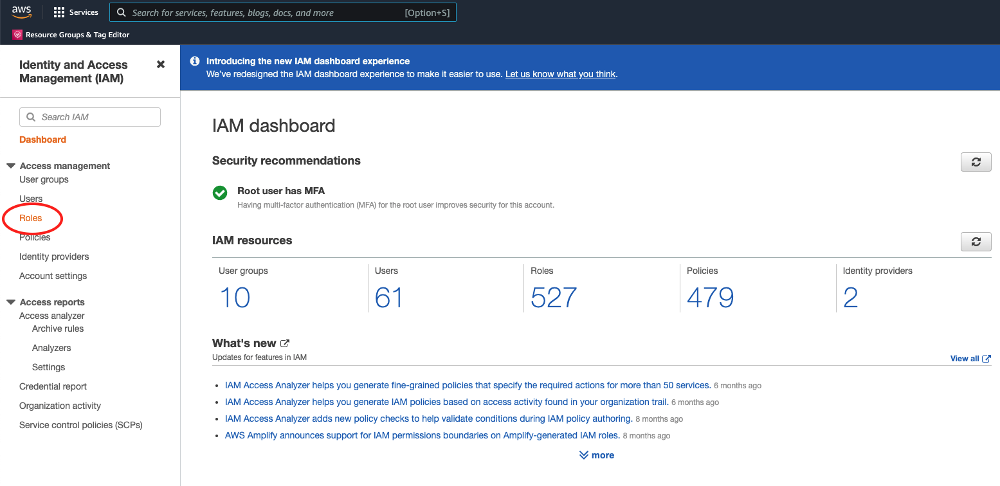
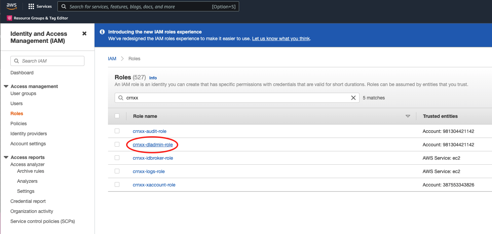
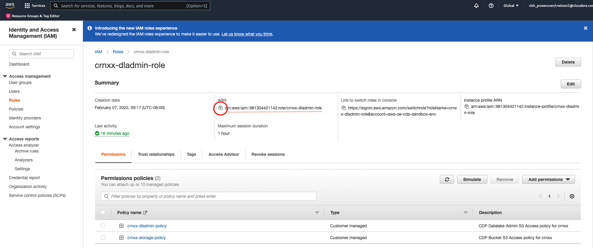
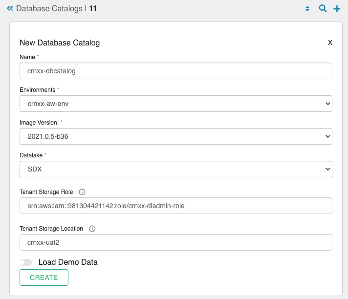
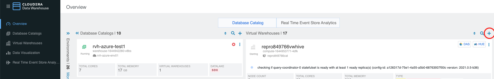
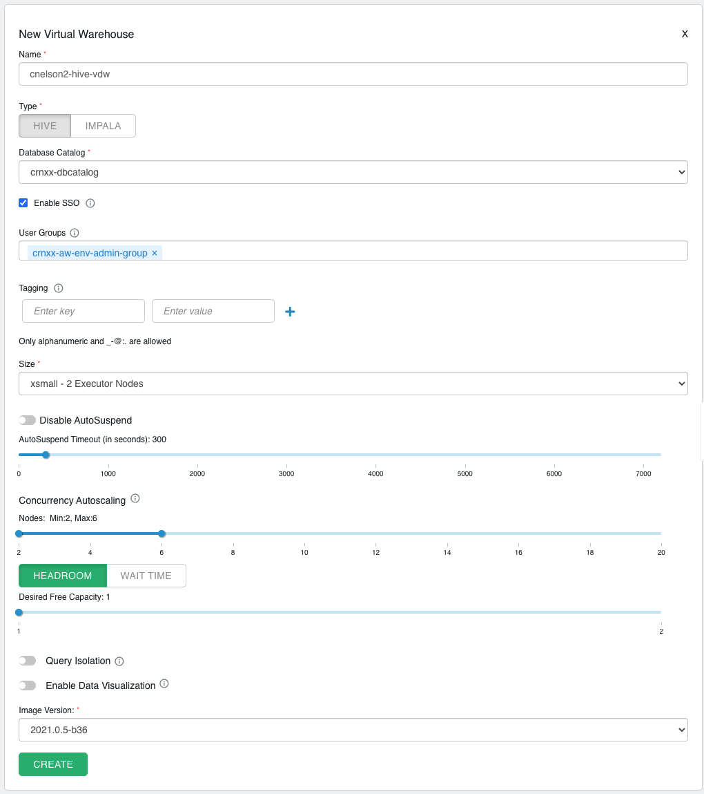
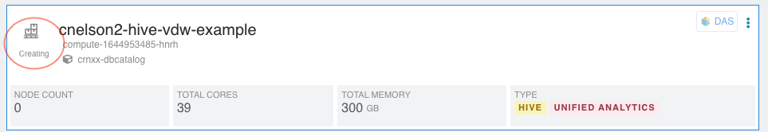
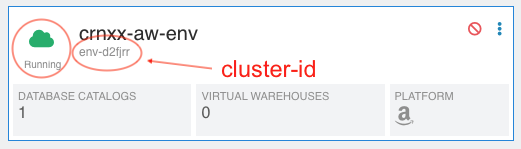

*assumes a CDP PC environment exists*


# Table of Contents

* Prequisites & Assumptions
  * [Prerequisites](#Prerequisites-and-Assumptions)

* Using the CDP Data Warehouse Console
  * [Creating a Database Catalog](#Creating-a-Database-Catalog-from-the-console)
  * [Creating a Hive Virtual Warehouse](#Hive-Virtual-Warehouse)

* Using the CDP CLI
  * [Creating/Activating a DW Environment/Cluster](#Create-the-DW-cluster)
  * [Creating a Database Catalog](#Creating-the-Database-Catalog)
  * [Creating a VW using the CDP CLI](#Creating-a-Virtual-warehouse)


* [Deleting the environment](#Deleting-the-environment)

---

# Prerequisites and Assumptions

* It is assumed you have a CDP (public cloud) environment built
* CDP CLI should be installed & configured
* jq should be installed, we're going to use it heavily

---

# Using the CDP Data Warehouse Console 

## Creating a Database Catalog from the console

From the CDP Data Warehouse console, click on the (+) under Database Catalogs.




### Getting the Tenant Storage Role

The Tenant Storage Role is also known as the datalake admin role, which you specified when you created the environment (or was created for you if you used something like cloudera-deploy to build your CDP environment).  Only you know for sure what the name of that role is, but it is probably of the form `<env prefix>-dladmin-role`.   Unfortunately we don't need the role name, we need the role ARN, which we must get from the AWS console.


1.  Go to the AWS Console
2.  Within AWS, go to the IAM page
3.  Click on `Roles` on the left hand navigation bar
4.  Find your role name through whatever means necessary.  You _may_ find it easiest to simply type in your environment prefix in the search bar
5.  Click on the role
6.  The ARN is found in the summary, along with a copy icon to make it easy copy the long ARN string









### Completing the form

Upon clicking the (+) to create a new database catalog, a form will come up.

* `Name:` Give your db catalog a name
* `Environments:` Specify your CDP environment
* `Image Version:` Pick the latest Image Version
* `Datalake:` Choose `SDX`
* `Tenant Storage Role:` Paste the role ARN
* `Tenant Storage Location:` the _name_ of the S3 bucket you specified when you created your CDP environment (no s3:// prefix; just the name of the bucket)





Then click `CREATE`.   It will take 5-10 minutes to create the database catalog.


---
## Hive Virtual Warehouse

From the Data Warehouse console within CDP, click on the (+) to reate a new Virtual Warehouse





* Give your virtual warehouse a name,  Be creative, but not too creative.  You can only use alphanumeric & dashes.
* Select `HIVE`
* Pick your database catalog from the dropdown.
* Make sure `Enable SSO` is checked.
* Under User Groups, select a usergroup to allow access to the virutal warehouse.  
  * You should find a user group called `<environment name>-admin-group` which will work nicely for this lab.
* Enter any tags you want attached to the cloud resources that get spun up to support the virtual warehouse.
* For size, start with xsmall (2 Executor Nodes) to minimize costs
* Disable Disable AusoSuspend (confusing?  Yes.   We want AutoSuspend to be _enabled_.), set the timeout to 300 seconds
* Set Concurrency Autoscaling to min=2, max=6
* Select `HEADROOM`
* Set Desired Free Capacity to 1
* Disable Query Isolation & do not enable Data Visualization
* Choose the most recent Image Version
* Click `CREATE`!

It will take several minutes to create the virtual data warehouse, keep an eye on the status.




---
---

# Using the CDP CLI
If you would rather build these components programatically, CDP has a CLI utility that allows you to build the pieces from the command line or shell script.  Combining the CDP CLI with liberal use of jq, we can string together 


## Create the DW Cluster
Creating a DW cluster requires at a minimum the CRN for your CDP environment and a list of subnets you want to deploy your DW cluster to.   The assumption is that it will deploy to all your subnets, since for our purposes it is typically only 3 subnets.

*NOTE:  the CLI calls this process creating a DW cluster, but the UI uses "activate/dectivate" terminology.  

### Establish an environment variable for your environment name:

```
export ENV_NAME=your-env-name
```

### Determine which subnets are in play

Creating a DW cluster requires specifying a subnet list.   We can determine these subnets by interrorgating our CDP environment to return a list of subnets.  Once we have a list of subnets, we need to flatten the array and quote & comma separate them, because that's how we'll need to present them later.
  * `cdp environments describe-environment --environment-name $ENV_NAME | jq -r '.environment.network.subnetIds | @csv'`


### Create the cluster
Lastly, we can string all that together to build the call to create the DW cluster.  Go grab a bite, this will run for the better part of an hour.

```
cdp dw create-cluster --environment-crn $(cdp environments describe-environment --environment-name $ENV_NAME | jq -r '.environment.crn') \
 --no-use-overlay-network \
 --no-use-private-load-balancer \
 --aws-options publicSubnetIds=$(cdp environments describe-environment --environment-name $ENV_NAME | jq -r '.environment.network.subnetIds | @csv')
```

The response to this call is a json object containing the cluster ID.  You can capture this, or remember it, or forget it.  We will be using other CLI calls to figure out what it is dynamically, because it is much more likely you need it but won't have it handy.  Of course you can also find it in the UI.

```
{
    "clusterId": "env-d2fjrr"
}
```




### Monitor creation progress
You can monitor the status of the cluster with this command.  Once the status is 'running' you can proceed to creating the database catalog.

```
cdp dw list-clusters | jq -r '.clusters[] | select(.environmentCrn == "'$(cdp environments describe-environment --environment-name $ENV_NAME | jq -r '.environment.crn')'").status'
```


## Creating the Database Catalog

Creating the database catalog is probably the most involved step in the process, since you must leave the warm comfort of CDP and get some information from AWS.


### Finding the Tenant Storage Role & Location.
When you created your CDP environment, several IAM roles were created in AWS.  If you used clodera-deploy to spin up your CDP environment, it is very likely the tenant storage role is named `<env prefix>-dladmin-role`.   We need the ARN for this IAM role, which we'll have to get from AWS.   The Tenant Storage Role is just the name of the s3 bucket where your data is found, as defined in your CDP environment.   If you used cloudera-deploy, that s3 bucket is probably named something like `<env prefix>-uat2`.

We'll use a few environment variables to make this a little more re-usable, obviously changing the values as necessary for your system.

`export CDP_TENANT_STORAGE_ROLE=crnxx-dladmin-role`

`export CDP_TENANT_STORAGE_LOCATION=crnxx-uat2`

And then find the role ARN from the AWS CLI
```
aws iam list-roles | jq -r '.Roles[] | select(.RoleName == "$(CDP_TENANT_STORAGE_ROLE").Arn'
```

which returns `arn:aws:iam::981304421142:role/crnxx-dladmin-role`, but yours will obviously be different.  You don't need the actual ARN, we will dynamically build the call by composting the AWS call with other CDP calls.


### Create the Database Catalog

```
cdp dw create-dbc --cluster-id $(cdp dw list-clusters | jq -r '.clusters[] | select(.environmentCrn == "'$(cdp environments describe-environment --environment-name $ENV_NAME | jq -r '.environment.crn')'").id') \
 --name crnxx-dbcatalog2 \
 --no-load-demo-data \
 --is-default \
 --tenant-storage-role $(aws iam list-roles | jq -r '.Roles[] | select(.RoleName == "$CDP_TENANT_STORAGE_ROLE").Arn') \
 --tenant-storage-location $CDP_TENANT_STORAGE_LOCATION
```

With a response like

```
{
    foo: bar
}
```


The response to this call is a json object containing the database catalog ID.  You can capture this, or remember it, or forget it.  We will be using other CLI calls to figure out what it is dynamically, because it is much more likely you need it but won't have it handy.  The db catalog ID can be found from the UI as well.


Expect it to take 5-10 minutes to create the database catalog, you can monitor build status with the CLI.   While you can string together CLI commands to build this dynamically, it can get pretty convoluted.   Probably best to just use the db catalog ID returned by the call to `create-dbc`


```
cdp dw describe-dbc --cluster-id $(cdp dw list-clusters | jq -r '.clusters[] | select(.environmentCrn == "'$(cdp environments describe-environment --environment-name $ENV_NAME | jq -r '.environment.crn')'").id')\
 --dbc-id warehouse-1645036606-s54g
```


## Creating a Virtual warehouse

The cluster ID & database catalog ID can be found in the CDP UI, or you

```
cdp dw create-vw --cluster-id $(cdp dw list-clusters | jq -r '.clusters[] | select(.environmentCrn == "'$(cdp environments describe-environment --environment-name $ENV_NAME | jq -r '.environment.crn')'").id') \
  --dbc-id  \
  --vw-type impala \
  --name cnelson2-cli-vdw \
  --template xsmall
```


---

## Deleting the environment 

Deleting from the top will will delete all the resources underneath it:  DW Cluster --> DB Catalog --> Virtual Warehouse
You can also surgically delete individual components from the bottom.


### Deactivate Data Warehouse environment (aka cluster)
This will delete the DW environment, which is called "Deactivate" in the UI.   Be careful with this, it can take a while to delete, and will automatically spawn the creation of a new cluster.  The db catalog & virtual warehouses will be deleted as well.

```
cdp dw delete-cluster --cluster-id $(cdp dw list-clusters | jq -r '.clusters[] | select(.environmentCrn == "'$(cdp environments describe-environment --environment-$ENV_NAME | jq -r '.environment.crn')'").id')
```

### Delete Database Catalog

Deleting the database catalog requires knowing the db catalog ID, but that requires knowing the cluster ID, so it requires nesting several CDP list commands to create the delete-dbc command for our db catalog.  The virtual warehouses will be deleted as well.

```
cdp dw delete-dbc --cluster-id $(cdp dw list-clusters | jq -r '.clusters[] | select(.environmentCrn == "'$(cdp environments describe-environment --environment-name $ENV_NAME | jq -r '.environment.crn')'").id') \
  --dbc-id $(cdp dw list-dbcs --cluster-id $(cdp dw list-clusters | jq -r '.clusters[] | select(.environmentCrn == "'$(cdp environments describe-environment --environment-name $ENV_NAME | jq -r '.environment.crn')'").id')
```


### Delete a virtual warehouse

Start by listing the vws for your cluster:

```
cdp dw list-vws --cluster-id $(cdp dw list-clusters | jq -r '.clusters[] | select(.environmentCrn == "'$(cdp environments describe-environment --environment-name $ENV_NAME | jq -r '.environment.crn')'").id')
```

Then run the delete command for the specific virtual warehouse you want to remove:

```
cdp dw delete-vw --cluster-id $(cdp dw list-clusters | jq -r '.clusters[] | select(.environmentCrn == "'$(cdp environments describe-environment --environment-name $ENV_NAME | jq -r '.environment.crn')'").id')
  --vw-id compute-1644863225-j8h8
```


